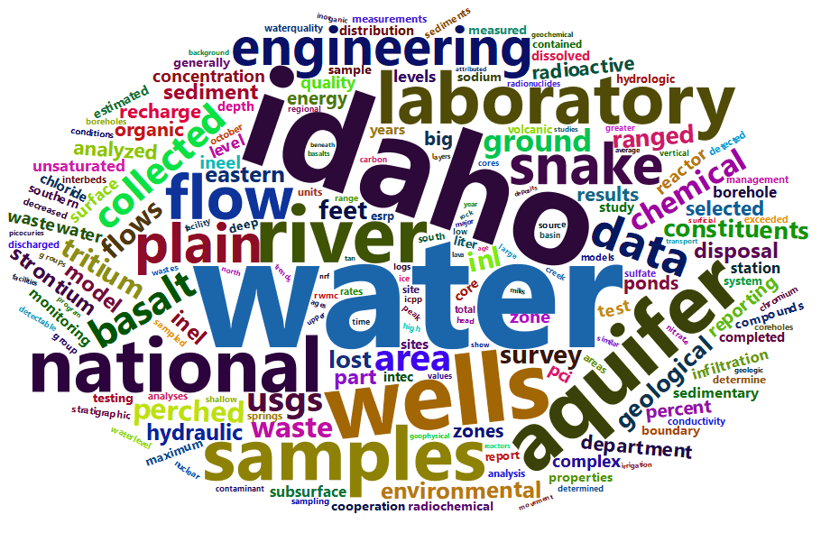

# inlpubs 

[](https://CRAN.R-project.org/package=inlpubs)
[](https://code.usgs.gov/inl/inlpubs/-/commits/main)
[](https://code.usgs.gov/inl/inlpubs/-/commits/main)

## Description

The **inlpubs** [R](https://www.r-project.org/) package enables users to
search and analyze 390 publications spanning the 76-year history of the
U.S. Geological Survey (USGS) Idaho Water Science Center and the Idaho
National Laboratory Project Office
([INLPO](https://www.usgs.gov/centers/idaho-water-science-center/science/idaho-national-laboratory-project-office)).
Authored by 266 researchers, these publications provide valuable
insights into the impacts of waste disposal on the eastern Snake River
Plain aquifer and the availability of water for long-term consumptive
and industrial use. The information within these publications is
critical for the management and utilization of the aquifer by the Idaho
National Laboratory ([INL](https://inl.gov/)) and the State of Idaho.
USGS geohydrologic studies and monitoring, initiated in 1920, were
conducted in cooperation with the U.S. Department of Energy Idaho
Operations Office.

<p>

<figure class="figure">


<figcaption class="figure-caption">

A word cloud showcasing the 200 most frequently used words in titles and
abstracts.
</figcaption>

</figure>

</p>

## Installation

To install the current release of the package from
[CRAN](https://CRAN.R-project.org/package=inlpubs), you can use the
following command in R:

``` r
install.packages("inlpubs")
```

To install the package along with its dependencies, which are required
to run examples in the package help documentation and build package
datasets, run:

``` r
install.packages("inlpubs", dependencies = TRUE)
```

To install the development version of the package, you can either clone
the repository and build it from source, or run the following commands.
Make sure the **remotes** package for R is installed.

``` r
remotes::install_gitlab(
  repo = "inl/inlpubs@develop",
  host = "code.usgs.gov",
  dependencies = TRUE
)
```

## Usage

Examples are given in the package help pages. To access these documents,
run:

``` r
library("inlpubs")
help(package = "inlpubs")
```

## Test

The **tinytest** package is used for unit testing. To run the tests, use
the following command:

``` r
tinytest::test_package("inlpubs")
```

## Authors

- Jason C. Fisher (ORCID iD
  [0000-0001-9032-8912](https://orcid.org/0000-0001-9032-8912))
- Kerri C. Treinen (ORCID iD
  [0000-0003-0645-6810](https://orcid.org/0000-0003-0645-6810))
- Allison R. Trcka (ORCID iD
  [0000-0001-8498-4737](https://orcid.org/0000-0001-8498-4737))

## Point of Contact

Jason C. Fisher (<jfisher@usgs.gov>)

## Suggested Citation

To cite **inlpubs** in publications, please use:

Fisher, J.C., 2022, inlpubs—Bibliographic information for the U.S.
Geological Survey Idaho National Laboratory Project Office: U.S.
Geological Survey software release, R package, Reston, Va.,
<https://doi.org/10.5066/P9I3GWWU>.

## Contributing

We value your contributions and suggestions on how to make these
materials more useful to the community. Please feel free to share your
thoughts by commenting on the [issue
tracker](https://code.usgs.gov/inl/inlpubs/-/issues) or opening a [merge
request](https://code.usgs.gov/inl/inlpubs/-/merge_requests) to
contribute.

## Code of Conduct

All contributions to- and interactions surrounding- this project will
abide by the [USGS Code of Scientific
Conduct](https://www.usgs.gov/office-of-science-quality-and-integrity/fundamental-science-practices).

<!-- Embedded References -->

## Disclaimer

This software is preliminary or provisional and is subject to revision.
It is being provided to meet the need for timely best science. The
software has not received final approval by the U.S. Geological Survey
(USGS). No warranty, expressed or implied, is made by the USGS or the
U.S. Government as to the functionality of the software and related
material nor shall the fact of release constitute any such warranty. The
software is provided on the condition that neither the USGS nor the U.S.
Government shall be held liable for any damages resulting from the
authorized or unauthorized use of the software.

Any use of trade, product, or firm names is for descriptive purposes
only and does not imply endorsement by the U.S. Government.

## License

Unless otherwise noted, this project is in the public domain in the
United States because it contains materials that originally came from
the United States Geological Survey, an agency of the United States
Department of Interior. For more information, see the official USGS
copyright policy at
[copyrights-and-credits](https://www.usgs.gov/information-policies-and-instructions/copyrights-and-credits).

Additionally, we waive copyright and related rights in the work
worldwide through the CC0 1.0 Universal public domain dedication.

#### CC0 1.0 Universal Summary

This is a human-readable summary of the [Legal Code (read the full
text)](https://creativecommons.org/publicdomain/zero/1.0/legalcode).

##### No Copyright

The person who associated a work with this deed has dedicated the work
to the public domain by waiving all of his or her rights to the work
worldwide under copyright law, including all related and neighboring
rights, to the extent allowed by law.

You can copy, modify, distribute and perform the work, even for
commercial purposes, all without asking permission.

##### Other Information

In no way are the patent or trademark rights of any person affected by
CC0, nor are the rights that other persons may have in the work or in
how the work is used, such as publicity or privacy rights.

Unless expressly stated otherwise, the person who associated a work with
this deed makes no warranties about the work, and disclaims liability
for all uses of the work, to the fullest extent permitted by applicable
law. When using or citing the work, you should not imply endorsement by
the author or the affirmer.

<!-- Embedded References -->

## Support

The Idaho National Laboratory Project Office of the USGS supports the
development and maintenance of **inlpubs**. Resources are available
primarily for maintenance and responding to user questions, and the
development team determines the priorities for the development of new
features.

## Additional Publication Details

Additional metadata about this publication, not found in other parts of
the page is in this table.

<!--html_preserve-->

<table>

<tbody>

<tr>

<th scope="row">

Publication type
</th>

<td>

Formal R language package
</td>

</tr>

<tr>

<th scope="row">

DOI
</th>

<td>

10.5066/P9I3GWWU
</td>

</tr>

<tr>

<th scope="row">

Year published
</th>

<td>

2022
</td>

</tr>

<tr>

<th scope="row">

Version
</th>

<td>

<a href='https://code.usgs.gov/inl/inlpubs/-/tree/v1.0.0'>1.0.0</a>
</td>

</tr>

<tr>

<th scope="row">

IPDS
</th>

<td>

IP-130851
</td>

</tr>

</tbody>

</table>

<cr><!--/html_preserve-->

<!-- Embedded References -->
